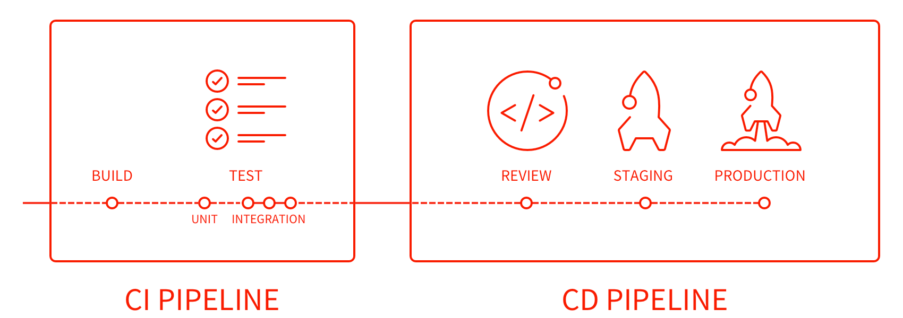

## Presentation Slides

https://docs.google.com/presentation/d/1hPqTTd8auXvezHbL5u-64NsO4Ka9y4gNYbCJQanPKUI/edit?usp=sharing

## Continuous Delivery

> More broadly the deployment pipeline's job is to detect any changes that will lead to problems in production. These can include performance, security, or usability issues. A deployment pipeline should enable collaboration between the various groups involved in delivering software and provide everyone visibility about the flow of changes in the system, together with a thorough audit trail.

> A good way to introduce continuous delivery is to model your current delivery process as a deployment pipeline, then examine this for bottlenecks, opportunities for automation, and collaboration points. From [DeploymentPipeline by Martin Fowler](https://martinfowler.com/bliki/DeploymentPipeline.html)

* From GitLab's Pipeline

* Workflow Example

From [Continuous Delivery on Wikipedia](https://en.wikipedia.org/wiki/Continuous_delivery)

### Pipeline As Code

> Teams are pushing for automation across their environments(testing), including their development infrastructure. Pipelines as code is defining the deployment pipeline through code instead of configuring a running CI/CD tool. LambdaCD, Drone, GoCD and Concourse are examples that allow usage of this technique. From [Thoughworks TechRadar](https://www.thoughtworks.com/radar/techniques/pipelines-as-code)

Jenkins approach is to have Groovy files, where most of the other players use yaml.

### Shift Left
From [Kubecon 2017 Deploying to Kubernetes Thousands of Times Per/Day - Dan Garfield, Codefresh & William Denniss, Google](https://schd.ws/hosted_files/kccncna17/2c/Kubecon%20-%20Deploying%20Thousands.pdf)

In the Typical Dev/Release Process, Staging becomes a bottleneck, so the solution is to Shift Left so earlier feedback is continuously provided on the feature branch.

### Deployment Strategies

From [k8s-deployment-strategies](https://github.com/ContainerSolutions/k8s-deployment-strategies)

#### Matrix

#### Blue/Green:

#### Canary:

### Rollback
See [How to rollout or rollback a deployment on a Kubernetes cluster?](https://romain.dorgueil.net/blog/en/tips/2016/08/27/rollout-rollback-kubernetes-deployment.html)

### Articles about Jenkins CI/CD Pipelines with Kubernetes

+ [How to setup CI/CD workflow for Node.js apps with Jenkins and Kubernetes](https://medium.com/containerum/how-to-setup-ci-cd-workflow-for-node-js-apps-with-jenkins-and-kubernetes-360fd0499556)
+ [Achieving CI/CD with Kubernetes](https://blog.jsjs.org/?p=165)
+ [Jenkins Pipelines with Kubernetes on Azure](https://radu-matei.com/blog/kubernetes-jenkins-azure/)
+ [Kubernetes on Azure: deliver applications continuously with Jenkins and Helm](https://blog.jcorioland.io/archives/2017/11/21/continuous-delivery-kubernetes-azure-jenkins-helm.html)
+ [The DevOps 2.4 Toolkit: Continuous Deployment To Kubernetes](https://leanpub.com/the-devops-2-4-toolkit)
+ 

### Alternative CI/CD Tools to investigate

We've heard good things, but not experienced.

#### Continuous Delivery Pipeline:
[JenkinsX](https://jenkins-x.io/)
[GitLab CI/CD](https://docs.gitlab.com/ee/ci/)

#### Bake:
[Kaniko](https://github.com/GoogleContainerTools/kaniko) (no more DinD DooD!)

##### Deploy:
+ [WeaveWorks Flux](https://github.com/weaveworks/flux)
[Skaffold](https://github.com/GoogleContainerTools/skaffold)
[Helm](https://github.com/kubernetes/helm)
