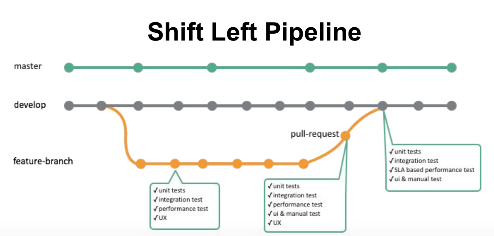

### Pipeline As Code

> Teams are pushing for automation across their environments(testing), including their development infrastructure. Pipelines as code is defining the deployment pipeline through code instead of configuring a running CI/CD tool. LambdaCD, Drone, GoCD and Concourse are examples that allow usage of this technique. From [Thoughworks TechRadar](https://www.thoughtworks.com/radar/techniques/pipelines-as-code)

Jenkins approach is to have Groovy files, where most of the other players use yaml.

### Shift Left
From [Kubecon 2017 Deploying to Kubernetes Thousands of Times Per/Day - Dan Garfield, Codefresh & William Denniss, Google](https://schd.ws/hosted_files/kccncna17/2c/Kubecon%20-%20Deploying%20Thousands.pdf):

### Deployment Strategies

From [k8s-deployment-strategies](https://github.com/ContainerSolutions/k8s-deployment-strategies)

#### Matrix

#### Blue/Green:

#### Canary:

### Rollback
See [How to rollout or rollback a deployment on a Kubernetes cluster?](https://romain.dorgueil.net/blog/en/tips/2016/08/27/rollout-rollback-kubernetes-deployment.html)
